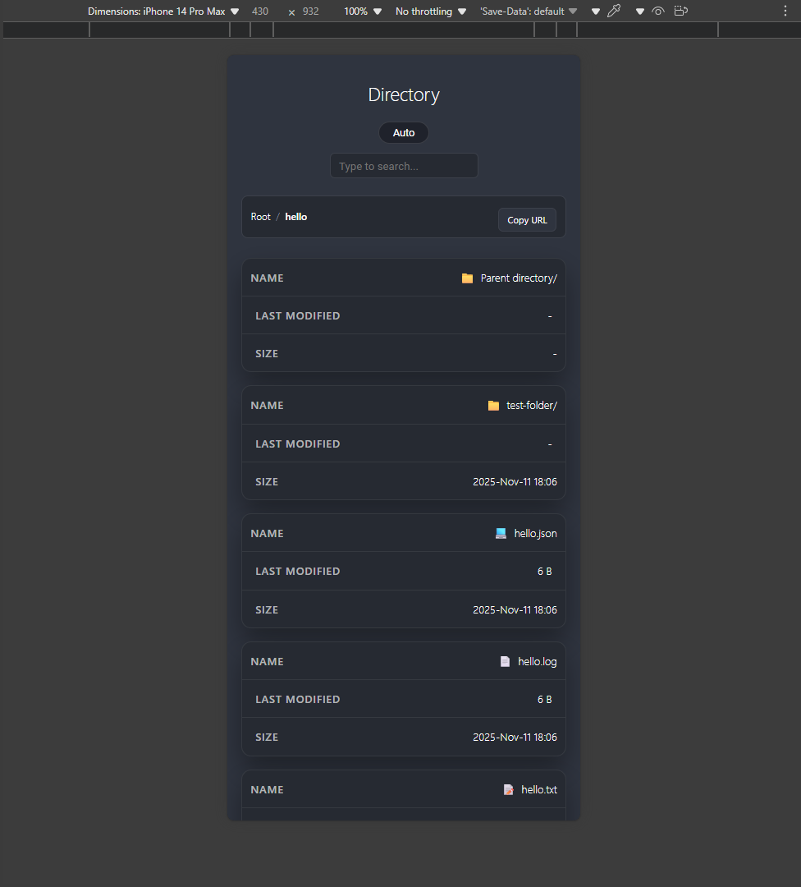
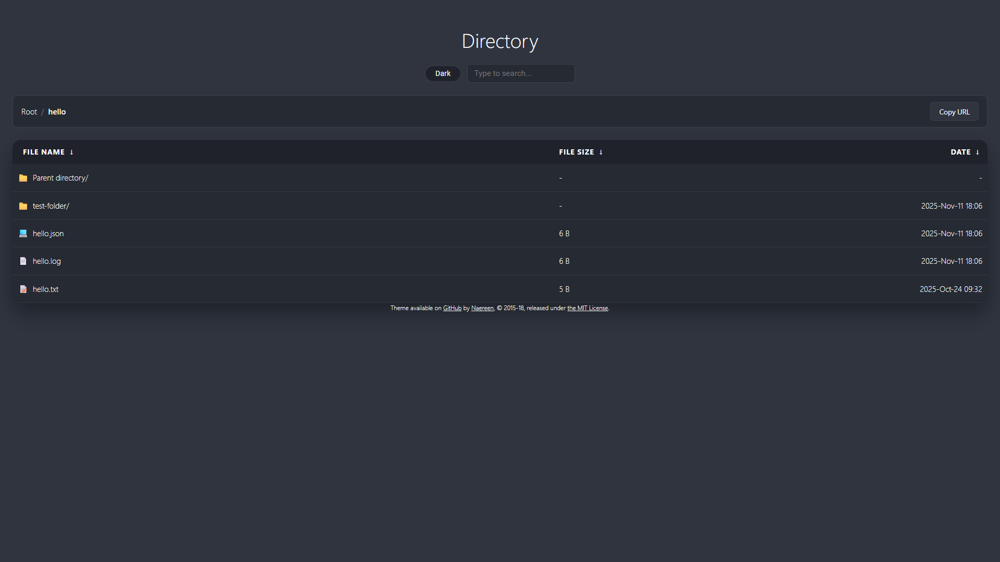
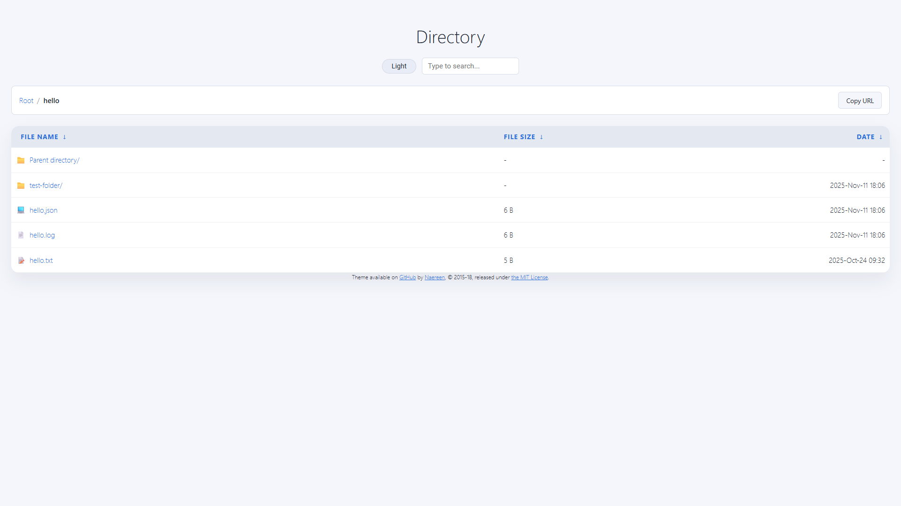

# Nginx-Fancyindex-Theme

A responsive theme for [Nginx](https://www.nginx.org/) [Fancyindex module](https://github.com/aperezdc/ngx-fancyindex) (by @aperezdc).

- [Nginx-Fancyindex-Theme](#nginx-fancyindex-theme)
  - [Usage](#usage)
    - [FancyIndex Installation sources](#fancyindex-installation-sources)
    - [Nginx Configuration](#nginx-configuration)
  - [Configuration Options](#configuration-options)
  - [Screenshots](#screenshots)

## Usage

1. Ensure the fancyindex package is built or installed
2. Update the nginx configuration with the fancy index flags
3. Move the `Nginx-Fancyindex/` folder to the root of the site directory as defined in the nginx configuration.
4. Restart/reload nginx.

### FancyIndex Installation sources

- RPM on EPEL 9: <https://rhel.pkgs.org/9/epel-x86_64/nginx-mod-fancyindex-0.5.2-3.el9.x86_64.rpm.html>
- Building from source: <https://github.com/aperezdc/ngx-fancyindex?tab=readme-ov-file#building>

### Nginx Configuration

```conf
...
http {
    ...
    server {
        listen 80;
        server_name X.X.X.X;
        root /var/www/html;

        # Serve content from /share
        location ^~ / {
            fancyindex on;
            fancyindex_localtime on;
            fancyindex_exact_size off;
            fancyindex_header "/Nginx-Fancyindex/header.html";
            fancyindex_footer "/Nginx-Fancyindex/footer.html";
            fancyindex_name_length 255;
            ...
        }
    }
}

```

```bash
# on Fedora-based OS (RHEL/CentOS/Rocky)
dnf install nginx-mod-fancyindex
nano /etc/nginx/nginx.conf
mv ./Nginx-Fancyindex /var/www/html/
# restorecon -Rv /var/www/html/
nginx -s reload
# OR: systemctl restart nginx.service
```

## Configuration Options

A standard configuration looks something like this:

```bash
fancyindex on;
fancyindex_localtime on;
fancyindex_exact_size off;
fancyindex_header "/Nginx-Fancyindex/header.html";
fancyindex_footer "/Nginx-Fancyindex/footer.html";
# Ignored files will not show up in the directory listing, but will still be public.
fancyindex_ignore "examplefile.html";
# Making sure folder where these files are do not show up in the listing.
fancyindex_ignore "Nginx-Fancyindex";
```

## Screenshots








---
