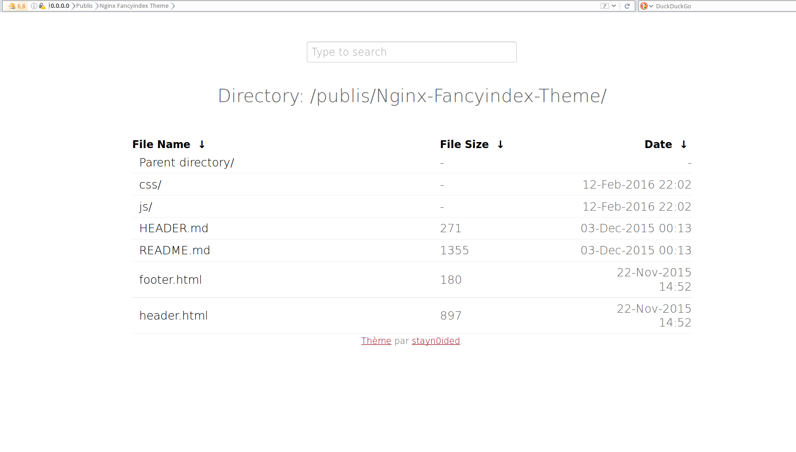
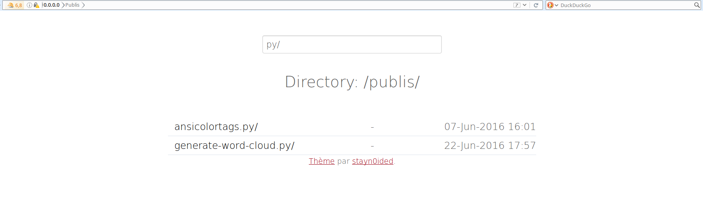

# Nginx-Fancyindex-Theme
A responsive theme for [Nginx](https://www.nginx.com/) Fancyindex module. Minimal, modern and simple.
Comes with a search form, aims to handle thousands of files without any problems.

The fancyindex module can be found [here](https://github.com/aperezdc/ngx-fancyindex).

## Usage

1. Make sure you have the fancyindex module compiled with nginx, either by compiling it yourself or installing nginx via the full distribution (paquet ``nginx-extras``).
2. Include the content of [fancyindex.conf](fancyindex.conf) in your location directive (``location / {.....}``) in your nginx config (usually ``nginx.conf``).
3. Move the ``Nginx-Fancyindex-Theme/`` folder to the root of the site directory.
4. Restart/reload nginx.
5. Check that it's working, and enjoy!

## Configuration

A standard config looks something like this:

```bash
fancyindex on;
fancyindex_localtime on;
fancyindex_exact_size off;
# Specify the path to the header.html and foother.html files (server-wise)
fancyindex_header "/Nginx-Fancyindex-Theme/header.html";
fancyindex_footer "/Nginx-Fancyindex-Theme/footer.html";
# Ignored files will not show up in the directory listing, but will still be public.
fancyindex_ignore "examplefile.html;
# Making sure folder where files are don't show up in the listing.
fancyindex_ignore "Nginx-Fancyindex-Theme;
# Maximum file name length in bytes, change as you like.
fancyindex_name_length 255;
```

## Examples
### Showing a list of files (without search):


---

### Filter a list of files (with search):


---

### Filter a list of directories (with search):


## :scroll: License
This (small) repository are published under the terms of the [MIT license](http://lbesson.mit-license.org/) (file [LICENSE.txt](LICENSE.txt)).

[](https://github.com/Naereen/Nginx-Fancyindex-Theme/)
